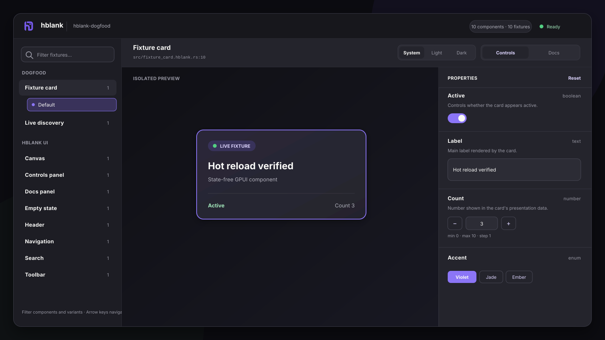

<div align="center">

# hblank

**Build and test GPUI components without launching the host app.**

[](https://www.rust-lang.org/)
[](https://gpui.rs/)
[](#project-status)

Hblank opens GPUI components in their own window. Fixtures sit beside the source, Rust props become controls, and saving a Rust file rebuilds the preview. No browser. No second JSON copy of your props.

</div>



## What it does

- Hblank finds fixture files from configured globs. The catalog groups named variants under each component and assigns stable `path#function` IDs.
- `#[derive(HblankProps)]` turns booleans, strings, numbers, and unit enums into editable controls.
- Docs come from Rustdoc or a typed `DocPage`. They can include live fixtures, props, controls, callouts, source, and project-defined native blocks.
- `hblank dev` rebuilds changed Rust code. If a build fails, the previous window stays open.
- `hblank test` runs the inline Rust and GPUI tests you write in fixture files.

## Try it now

Clone it and launch the project Hblank uses to develop itself:

```bash
git clone https://github.com/mmmeff/hblank.git
cd hblank
cargo run -p hblank-cli -- dev --project fixtures/dogfood
```

This opens the fixture card plus the components that make up Hblank's own UI.

To jump straight to one variant:

```bash
cargo run -p hblank-cli -- dev \
  --project fixtures/dogfood \
  --fixture-id 'src/fixture_card.hblank.rs#fixture_card_default'
```

## Teach an agent Hblank

This repo includes an `hblank` agent skill. Install it with:

```bash
npx skills add mmmeff/hblank
```

The skill knows Hblank's macros, CLI, reload behavior, and failure modes. It also tells the agent to check the real GPUI window instead of stopping at a clean compile. A useful prompt:

```text
Use the hblank skill to add an isolated loading-state variant for AccountCard,
run it by exact fixture ID, and verify every generated control.
```

Run `npx skills add mmmeff/hblank --list` to read the skill before installing it.

## Framework support

`hblank-core` defines props, controls, component metadata, variants, IDs, docs, themes, and catalog construction. It has no GPUI dependency. The `hblank` crate adds GPUI rendering and launches the desktop app.

GPUI is the only adapter included now. To add another Rust UI framework, implement its adapter against `hblank-core` without linking GPUI.

## Add Hblank to a GPUI project

`main` is at 0.3.0, but crates.io still lacks the complete four-crate release. Use a checkout if you need the component-first API:

```bash
# From the hblank checkout
cargo install --path crates/hblank-cli

# From your GPUI project
cargo add hblank --path /path/to/hblank/crates/hblank
hblank init
hblank dev
```

`hblank init` writes five files under `.hblank/`. It leaves the host manifest and source alone, and it refuses to overwrite existing files.

```text
.hblank/
├── .gitignore           # Ignores builds, generated imports, and runtime state
├── config.toml          # Fixture globs, theme hook, and window size
├── Cargo.toml           # Private preview crate
├── src/main.rs          # Preview entry point
└── generated/fixtures.rs
```

Hblank uses crates.io GPUI 0.2.2 by default. Zed projects can disable default features and enable `zed-gpui`.

## Build a component fixture

### 1. Make the props controllable

Hblank derives controls from ordinary Rust types and uses field doc comments as control help text.

```rust
use hblank::{HblankEnum, HblankProps};

#[derive(Clone, Copy, Default, HblankEnum)]
pub enum Tone {
    #[default]
    Neutral,
    Success,
    Warning,
}

#[derive(Clone, HblankProps)]
pub struct BadgeProps {
    /// Whether the badge uses its emphasized treatment.
    pub emphasized: bool,
    /// Text rendered inside the badge.
    pub label: String,
    /// Number displayed beside the label.
    pub count: u32,
    /// Semantic color treatment.
    pub tone: Tone,
}

impl Default for BadgeProps {
    fn default() -> Self {
        Self {
            emphasized: true,
            label: "Ready".to_owned(),
            count: 3,
            tone: Tone::Neutral,
        }
    }
}
```

The production render function stays ordinary GPUI:

```rust
use gpui::{App, Div, Window, div, prelude::*, px, rgb};

pub fn badge(props: &BadgeProps, _window: &mut Window, _cx: &mut App) -> Div {
    let (accent, background) = match props.tone {
        Tone::Neutral => (rgb(0x6f6f77), rgb(0xf1f1ee)),
        Tone::Success => (rgb(0x258b63), rgb(0xe8f6ef)),
        Tone::Warning => (rgb(0xc65d3b), rgb(0xffeee8)),
    };

    div()
        .flex()
        .items_center()
        .gap_2()
        .px_3()
        .h(px(30.0))
        .rounded_full()
        .border_1()
        .border_color(accent)
        .text_color(accent)
        .when(props.emphasized, |badge| badge.bg(background))
        .child(props.label.clone())
        .child(format!("{}", props.count))
}
```

### 2. Add a matching fixture file

The default pattern is `src/**/*.hblank.rs`. Create `src/badge.hblank.rs`:

```rust
use hblank::{CalloutTone, DocBlock, DocPage};
use hblank::gpui::{App, IntoElement, Window};
use hblank_project::{BadgeProps, Tone, badge};

#[hblank::component(
    title = "Badge",
    group = "Components",
    docs = badge_docs
)]
/// A compact status badge. Hblank uses this Rustdoc in the generated Docs page.
fn badge_fixture(
    props: &BadgeProps,
    window: &mut Window,
    cx: &mut App,
) -> impl IntoElement {
    badge(props, window, cx)
}

#[hblank::fixture(component = badge_fixture, title = "Default")]
fn badge_default() -> BadgeProps {
    BadgeProps::default()
}

#[hblank::fixture(component = badge_fixture, title = "Warning")]
fn badge_warning() -> BadgeProps {
    BadgeProps {
        tone: Tone::Warning,
        ..BadgeProps::default()
    }
}

fn badge_docs() -> DocPage {
    DocPage::new([
        DocBlock::heading(1, "Badge"),
        DocBlock::prose("Compact semantic status for dense interfaces."),
        DocBlock::fixture(hblank::fixture_ref!(badge_warning)),
        DocBlock::props(),
        DocBlock::controls(),
        DocBlock::callout(
            CalloutTone::Note,
            "Usage",
            "Use warning tone only when the user can take action.",
        ),
        DocBlock::source(),
    ])
}
```

One component owns one props type and one renderer. Fixture functions return its named starting states. The sidebar nests those variants under the component.

A `DocPage` controls what appears in Docs and in what order. Built-in blocks cover headings, prose, live fixtures, props, controls, callouts, and source. For a project-specific native block, register a renderer with `#[hblank::doc_block]` and embed it with `hblank::custom_doc!(renderer, payload)`. The renderer gets read-only component, fixture, and theme data through `DocContext`.

Hblank takes component and fixture source from the macro input. The Docs tab shows normalized declarations with project-relative paths. It does not preserve whitespace or ordinary comments.

Save the file. A running `hblank dev` rebuilds the preview and adds **Badge** to navigation without restarting the command.

### 3. Try the states

Select **Badge** and edit its controls:

| Rust field | Harness control |
|---|---|
| `bool` | Toggle |
| `String` | Direct single-line editor. `#[hblank(multiline)]` enables multiline editing |
| Integer or float | Direct editor plus stepper. `min`, `max`, and `step` attributes enforce constraints |
| `#[derive(HblankEnum)]` unit enum | Option chips for small enums, compact list for larger enums |

Use `#[hblank(skip)]` when a field should stay in the props type but should not get a control. Controls stay in Rust field order. Each valid edit changes the typed props and rerenders the GPUI component.

Keep domain types in production code. To edit a newtype, implement `HblankControlAdapter<T>` and convert it to a built-in value such as `u8` or `String`. Hblank still handles the editor, limits, reset button, and saved session values.

## Configure discovery

Edit `.hblank/config.toml` when your project uses a different convention:

```toml
fixtures = [
    "src/**/*.hblank.rs",
    "fixtures/**/*.fixture.rs",
]
ignore = [
    "target/**",
    ".hblank/**",
    "src/generated/**",
]

theme_hook = "my_app::apply_hblank_theme"

[window]
title = "my-app · Hblank"
width = 1440
height = 900
```

Patterns start at the project root. Hblank sorts matches, accepts duplicate file names in different directories, and gives every generated module a stable name.

## System, light, and dark themes

System mode follows the OS. Light and Dark overrides last for the current `hblank dev` command. Without a project hook, only Hblank's own UI changes.

To switch the component theme too, annotate one hook and put its Rust path in `.hblank/config.toml`:

```rust
#[hblank::theme_hook]
pub fn apply_hblank_theme(
    mode: hblank::ThemeMode,
    resolved: hblank::ResolvedTheme,
    cx: &mut hblank::gpui::App,
) {
    cx.set_global(ProjectTheme::from_hblank(mode, resolved));
}
```

The hook receives the selected mode and the resolved Light or Dark appearance. In System mode, Hblank listens for GPUI window appearance changes.

## Development loop

```bash
hblank dev
hblank list
hblank dev --fixture src/badge.hblank.rs
hblank dev --fixture-id 'src/badge.hblank.rs#badge_warning'
hblank test
hblank test --filter fixture_card_default_and_docs_are_explicit
```

`hblank list` builds the preview and prints tab-separated component and fixture records. `--fixture PATH` opens the first variant in a source file. `--fixture-id PATH#FUNCTION` opens one exact fixture and rejects unknown IDs before the window starts. You cannot combine the two selectors.

While it runs:

- Adding or removing a matched fixture file refreshes navigation.
- Changing component or fixture Rust code starts a debounced rebuild.
- A successful build starts the new preview, restores the current selection and control values, then stops the old preview.
- A new `hblank dev` command starts from fixture defaults.
- A failed build leaves the last good window open and prints the compiler error.
- `↑` and `↓` move through filtered fixtures. `Esc` clears the filter.
- `Cmd` plus `=` or `+` zooms in. `Cmd` plus `-` zooms out. Use `Super` on Linux and `Win` on Windows.

Hot reload rebuilds the Rust preview and restarts it under a supervisor. It does not load dynamic libraries.

## Typed component tests

A component can return a typed handle for tests while rendering the same GPUI element in production:

```rust
#[hblank::component(title = "Account card", group = "Components", handle = AccountHandle)]
fn account_card_component(...) -> hblank::Rendered<AccountHandle, impl IntoElement> {
    hblank::Rendered::new(account_card(...), handle)
}

#[gpui::test]
fn account_card_updates(cx: &mut hblank::testing::TestAppContext) {
    let cx = cx.add_empty_window();
    let handle = hblank::testing::draw_with_handle(cx, size(px(640.), px(480.)), |window, app| {
        hblank::render_handle!(account_card_component, &props, window, app)
    });
    assert_eq!(handle.status(), Status::Ready);
}
```

`hblank::testing` re-exports GPUI's deterministic test contexts. Its helpers draw a fixture or typed handle and click known bounds. Tests use project state and ordinary Rust assertions. Hblank does not add selectors or an assertion language.

## Hblank builds itself

Hblank's header, search, navigation, toolbar, canvas, controls, docs, and empty state are regular props-in, elements-out GPUI functions under `hblank::harness`. Each one has a fixture in `fixtures/dogfood/src/harness.hblank.rs`:

```bash
cargo run -p hblank-cli -- dev --project fixtures/dogfood
```

This is a useful constraint. If the dogfood fixture breaks, Hblank can no longer inspect its own UI.

## Migrating pre-component fixtures

The old `#[hblank::fixture(id, title, group)] fn(&Props, Window, App)` form is gone. Move the renderer to `#[hblank::component(title, group)]`. Then add one zero-argument `#[hblank::fixture(component = renderer, title)] -> Props` function for each state. Remove explicit IDs and get the new `path#function` values from `hblank list`.

Older preview manifests need `test-support` on `gpui` and `hblank`, a direct `gpui = "0.2.2"` dependency, and `pub use hblank::gpui;` in preview main. New projects get this from `hblank init`.

## Commands

```text
hblank init [--project PATH] [--runtime-path PATH]
    Create the .hblank config and preview crate. Refuse to overwrite files.

hblank dev [--project PATH] [--fixture PATH | --fixture-id ID]
    Find fixtures, choose an optional source or exact ID, open the GPUI window, and watch files.

hblank list [--project PATH]
    Build and print components plus canonical fixture records.

hblank test [--project PATH] [--filter FILTER]
    Regenerate preview imports and run explicit inline Rust tests with Cargo.
```

## Releases

Pushes to `main` run semantic-release. The conventional commit type sets one version for `hblank-core`, `hblank-macros`, `hblank`, and `hblank-cli`:

- fix commits publish a patch release.
- feat commits publish a minor release.
- BREAKING CHANGE footers or commits marked with ! publish a major release.
- docs, test, and chore commits do not publish.

The release job updates versions, `Cargo.lock`, and `CHANGELOG.md`, then commits and tags the release. It publishes core, macros, runtime, and CLI in that order, waiting for crates.io to index each crate. A retry skips any version that already exists.

Before publishing from a new repository, run the setup wizard to claim unpublished crate names and replace the temporary crates.io token with GitHub OIDC Trusted Publishing:

    scripts/setup-release.sh

After that, GitHub releases do not need a crates.io secret.

## Project status

Hblank is pre-1.0. `main` is version 0.3.0 and targets GPUI 0.2.2. Crates.io still has an incomplete set of Hblank crates, so use a checkout for the component-first API.

