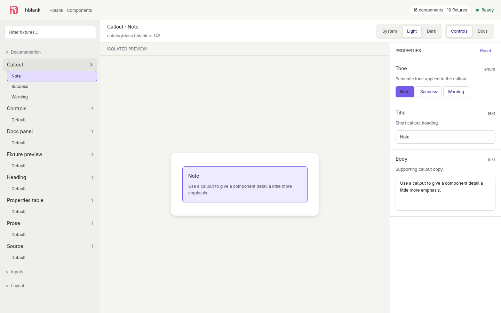

<div align="center">

# hblank

**Build GPUI components in isolation. See every state. Change anything live.**

[](https://www.rust-lang.org/)
[](https://gpui.rs/)
[](#project-status)

Hblank is the Rust/GPUI analog to Storybook: glob-discovered component fixtures, generated property controls, Rustdoc beside the preview, and automatic rebuilds in a dedicated GPUI desktop harness.

</div>



## Try it now

Clone the repository and launch Hblank's dogfood project:

```bash
git clone https://github.com/mmmeff/hblank.git
cd hblank
cargo run -p hblank-cli -- dev --project fixtures/dogfood
```

A GPUI window opens with Hblank's fixture card and every presentational component used to build the harness itself.

## Give your AI agent Hblank

Install the framework skill into any agent supported by the Skills CLI:

```bash
npx skills add mmmeff/hblank
```

The command resolves `https://github.com/mmmeff/hblank`; the repository must be public or accessible through the user's GitHub credentials.

The installed skill is named `hblank`. It gives the agent the framework model, exact component and fixture contracts, CLI workflows, generated-control rules, Rustdoc behavior, direct fixture launch, hot-reload lifecycle, debugging decision tree, and verification gates.

Invoke it before component work, for example:

```text
Use the hblank skill to add an isolated loading-state fixture for AccountCard, run it directly, and verify every control.
```

The skill teaches agents to:

- initialize or inspect an existing `.hblank/` project without overwriting configuration;
- build state-free GPUI components with typed `HblankProps` and `HblankEnum` controls;
- author discovered `*.hblank.rs` fixtures with automatic Rustdoc;
- open the exact file under development with `hblank dev --fixture PATH`;
- iterate against the real GPUI harness and diagnose discovery, compilation, control, docs, and reload failures;
- finish with direct UI evidence plus repository formatting, lint, and test gates.

To inspect the published skill before installing:

```bash
npx skills add mmmeff/hblank --list
```

## Add Hblank to a GPUI project

Until the crates are published, install from a local checkout:

```bash
# From the hblank checkout
cargo install --path crates/hblank-cli

# From your GPUI project
cargo add hblank --path /path/to/hblank/crates/hblank
hblank init
hblank dev
```

`hblank init` creates only a dedicated `.hblank/` directory. It does not rewrite the host manifest or overwrite existing files.

```text
.hblank/
├── config.toml          # Discovery patterns and window settings
├── Cargo.toml           # Private preview crate
├── src/main.rs          # Harness entry point
└── generated/           # Regenerated by hblank dev
```

## Build a component fixture

### 1. Make the props controllable

Hblank derives controls from ordinary Rust types and uses field doc comments as control help text.

```rust
use hblank::{HblankEnum, HblankProps};

#[derive(Clone, Copy, Default, HblankEnum)]
pub enum Tone {
    #[default]
    Neutral,
    Success,
    Warning,
}

#[derive(Clone, HblankProps)]
pub struct BadgeProps {
    /// Whether the badge uses its emphasized treatment.
    pub emphasized: bool,
    /// Text rendered inside the badge.
    pub label: String,
    /// Number displayed beside the label.
    pub count: u32,
    /// Semantic color treatment.
    pub tone: Tone,
}

impl Default for BadgeProps {
    fn default() -> Self {
        Self {
            emphasized: true,
            label: "Ready".to_owned(),
            count: 3,
            tone: Tone::Neutral,
        }
    }
}
```

Use `BadgeProps` in a normal, state-free GPUI render function:

```rust
use gpui::{App, Div, Window, div, prelude::*, px, rgb};

pub fn badge(props: &BadgeProps, _window: &mut Window, _cx: &mut App) -> Div {
    let (accent, background) = match props.tone {
        Tone::Neutral => (rgb(0x6f6f77), rgb(0xf1f1ee)),
        Tone::Success => (rgb(0x258b63), rgb(0xe8f6ef)),
        Tone::Warning => (rgb(0xc65d3b), rgb(0xffeee8)),
    };

    div()
        .flex()
        .items_center()
        .gap_2()
        .px_3()
        .h(px(30.0))
        .rounded_full()
        .border_1()
        .border_color(accent)
        .text_color(accent)
        .when(props.emphasized, |badge| badge.bg(background))
        .child(props.label.clone())
        .child(format!("{}", props.count))
}
```

### 2. Add a matching fixture file

The default pattern is `src/**/*.hblank.rs`. Create `src/badge.hblank.rs`:

```rust
use hblank::gpui::{App, IntoElement, Window};
use hblank_project::{BadgeProps, badge};

#[hblank::component(title = "Badge", group = "Components")]
/// A compact status badge. This Rustdoc appears automatically in the Docs panel.
fn badge_fixture(
    props: &BadgeProps,
    window: &mut Window,
    cx: &mut App,
) -> impl IntoElement {
    badge(props, window, cx)
}

#[hblank::fixture(component = badge_fixture, title = "Default")]
fn badge_default() -> BadgeProps {
    BadgeProps::default()
}
```

Save the file while `hblank dev` is running. The harness discovers it, rebuilds the private preview crate, and adds **Badge** to navigation without restarting the command.

### 3. Exercise every state

Open **Badge** and change its generated controls:

| Rust field | Harness control |
|---|---|
| `bool` | Toggle |
| `String` | Editable text |
| Integer or float | Stepper |
| `#[derive(HblankEnum)]` unit enum | Option buttons |

Every accepted change updates the typed props and rerenders the isolated GPUI component immediately.

## Configure discovery

Edit `.hblank/config.toml` when your project uses a different convention:

```toml
fixtures = [
    "src/**/*.hblank.rs",
    "fixtures/**/*.fixture.rs",
]
ignore = [
    "target/**",
    ".hblank/**",
    "src/generated/**",
]

[window]
title = "my-app · Hblank"
width = 1440
height = 900
```

Patterns are project-root-relative. Discovery order is deterministic, duplicate file names are safe, and generated module identifiers remain stable.

## Development loop

```bash
hblank dev
hblank dev --fixture src/badge.hblank.rs
```

`--fixture` opens directly to the first registered fixture in that source file. Relative paths resolve from `--project`; absolute paths work too. If a file contains multiple fixtures, Hblank chooses the first in deterministic navigation order.

While it runs:

- adding or removing a matching fixture file refreshes navigation;
- changing component or fixture Rust code triggers a debounced rebuild;
- a successful build automatically replaces the preview process and restores the selected fixture;
- a failed build leaves the last successful harness open and prints the compiler failure;
- `↑` and `↓` move through filtered fixtures, and `Esc` clears the filter.
- `Cmd` + `=` or `+` zooms in and `Cmd` + `-` zooms out (`Super` on Linux, `Win` on Windows).

Hot reload is a safe supervised Rust rebuild, not unstable dynamic-library ABI loading.

## Use Hblank to build Hblank

The harness itself is GPUI-rendered. Its header, search, navigation, toolbar, canvas, controls panel, docs panel, and empty state are props-in/elements-out presentational functions under `hblank::harness`.

Every one has an independently discoverable fixture in `fixtures/dogfood/src/harness.hblank.rs`:

```bash
cargo run -p hblank-cli -- dev --project fixtures/dogfood
```

That fixture is the contract: Hblank must remain capable of building and inspecting Hblank.

## Commands

```text
hblank init [--project PATH] [--runtime-path PATH]
    Create .hblank config and preview boilerplate without overwriting files.

hblank dev [--project PATH] [--fixture PATH]
    Discover fixture files, optionally select a fixture path, launch the GPUI harness, and watch for changes.
```

## Releases

Pushes to main run semantic-release. Conventional commits determine the next lockstep version for hblank-macros, hblank, and hblank-cli:

- fix commits publish a patch release;
- feat commits publish a minor release;
- BREAKING CHANGE footers or commits marked with ! publish a major release;
- docs, test, and chore commits do not publish.

The workflow updates the workspace and internal dependency versions, updates Cargo.lock and CHANGELOG.md, commits and tags the release, publishes the three crates in dependency order, waits for crates.io indexing between them, and creates the GitHub release. Partial crate publication is retry-safe.

Run the one-time setup wizard to bootstrap the unpublished crate names and replace the temporary crates.io token with GitHub OIDC Trusted Publishing:

    scripts/setup-release.sh

After setup, releases require no crates.io secret in GitHub.

## Project status

Hblank is pre-1.0 and currently targets GPUI `0.2.2`. The core workflow is implemented and dogfooded: initialization, glob discovery, typed controls, Rustdoc extraction, GPUI navigation, and supervised hot reload.

